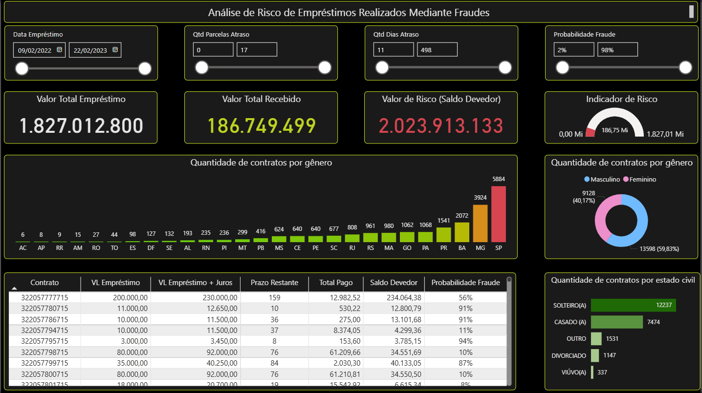

# 🛡️ Pipeline de Detecção de Fraudes com Python e Power BI

Este projeto implementa uma **pipeline completa de Machine Learning** para detecção de fraudes em operações financeiras, utilizando **Python**, **Power BI** e técnicas de aprendizado supervisionado. O objetivo é prever automaticamente se uma transação é suspeita ou legítima, com visualizações integradas no Power BI para tomada de decisão.


---

## 📊 Dashboard Interativo (Power BI)

Explore o painel com os principais insights da análise de fraudes:

🔗 [Clique aqui para visualizar o dashboard no Power BI Web](https://app.powerbi.com/view?r=eyJrIjoiMTk0ZDVmMDEtZGQxYS00MjVkLTgxODktNGY2ZDdmZjhjZWQwIiwidCI6IjI3MTA1ZGYzLTBhYmItNGMyMy05NmQyLTk2N2FiMmEyNmQ5YSJ9)

> O dashboard exibe a distribuição das fraudes por canal, estado civil, tempo de relacionamento e faixa de renda, com filtros dinâmicos e métricas de impacto financeiro.

---

## 🧰 Tecnologias Utilizadas

### 🚀 Linguagens e Plataformas
- **Python 3.13**
- **Power BI Desktop + Web**
- **Jupyter Notebook**

### 📦 Principais Bibliotecas Python
- `pandas` – manipulação de dados
- `numpy` – operações numéricas
- `scikit-learn` – machine learning (Random Forest, split, encoding, métricas)
- `joblib` – persistência de modelo
- `seaborn` e `matplotlib` – visualização de dados
- `openpyxl` – exportação de resultados em Excel

---

## 📁 Estrutura do Projeto

```
Pipelide_Deteccao_Fraude/
├── data/
│   ├── raw/               # Dados originais
│   ├── new/               # Novos dados para predição
│   └── output/            # Resultados gerados
├── notebooks/
│   └── fraud-detection-prediction-pipeline.ipynb
├── src/
│   ├── gerar_modelo.py    # Script de treinamento
│   └── gerar_previsoes.py # Script de predição
├── models/
│   └── modelo_treinado_fraude.pk
├── images/
│   └── dashboard_powerbi.png
├── .github/
│   └── profile/
│       └── fraud-detection-banner.png
├── requirements.txt
└── README.md
```

---

## ⚙️ Como Executar

```bash
# Clonar o repositório
git clone https://github.com/leojoker/Pipelide_Deteccao_Fraude.git
cd Pipelide_Deteccao_Fraude

# Criar ambiente virtual (opcional)
python -m venv venv
source venv/bin/activate  # ou venv\Scripts\activate no Windows

# Instalar dependências
pip install -r requirements.txt

# Rodar o notebook
jupyter notebook notebooks/fraud-detection-prediction-pipeline.ipynb

# Ou executar os scripts separadamente
python src/gerar_modelo.py
python src/gerar_previsoes.py
```

---

## 📷 Visualização do Dashboard



---

## 👤 Autor

**Leonardo Barbosa**  
Cientista de Dados com foco em prevenção de fraudes, análise preditiva e visual analytics.  
📫 [linkedin.com/in/leonardo-barbosa](https://www.linkedin.com/in/leonardo-barbosa777)

---

## 📝 Licença

MIT – Este projeto é livre para uso educacional e profissional.
